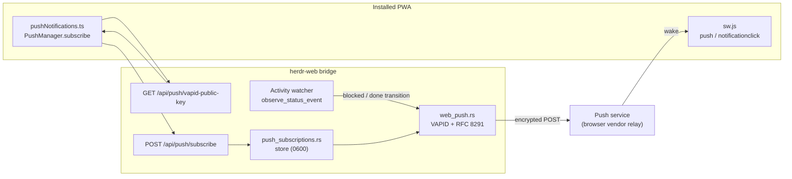
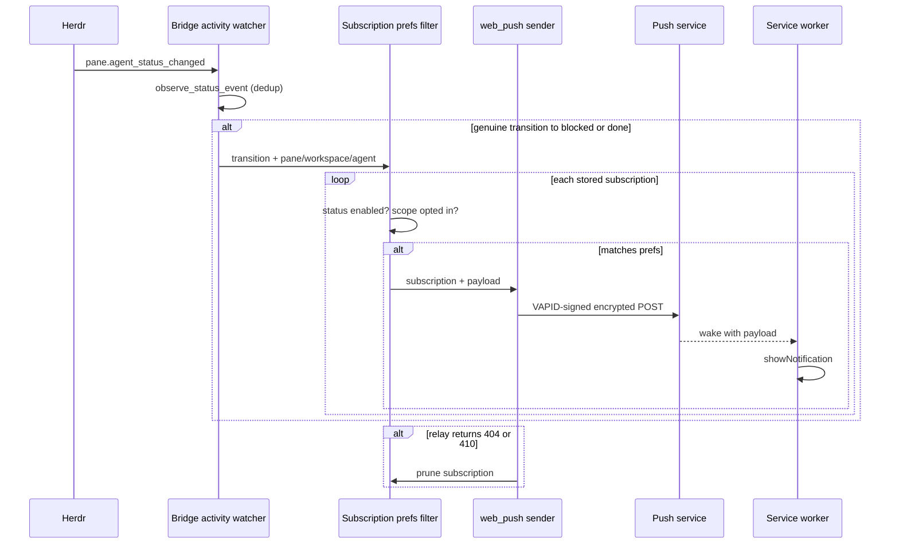

# Push Notifications Design

`herdr-web` already detects agent status transitions inside the bridge: the shared activity watcher
observes Herdr `pane.agent_status_changed` events and emits a deduplicated signal on every genuine
transition, independent of whether any browser is connected. This design reuses that existing signal
to deliver Web Push notifications so a user is alerted on their phone or desktop when an agent enters
an attention state (`blocked` or `done`) — even when no `herdr-web` tab is open.

Delivery uses self-hosted [Web Push](https://www.w3.org/TR/push-api/) with
[VAPID](https://datatracker.ietf.org/doc/html/rfc8292) and
[RFC 8291](https://datatracker.ietf.org/doc/html/rfc8291) payload encryption. The bridge is the
application server: it stores push subscriptions and makes outbound HTTPS requests to each
subscription's push endpoint. There is no Firebase project, no service account, and no cloud
configuration. This keeps the feature aligned with the project's local-first, no-cloud model, and it
requires only outbound network access from the bridge — no new inbound exposure.

The notification target is the installed Progressive Web App (desktop browsers, Android via
Chrome "Add to Home Screen", and iOS 16.4+ via Home Screen install). The existing Capacitor APK and
an FCM-based path are explicitly out of scope for this design; see Non-Goals.

## Goals

- Notify the user when an agent enters `blocked` or `done`, without a `herdr-web` tab being open.
- Reuse the bridge's existing server-side transition signal; do not add a second observer.
- Keep subscription storage and the send path inside the bridge, mirroring existing feature modules.
- Filter notifications server-side by user preferences so filtering works with no browser connected.
- Add no cloud dependency: no Firebase, no service account, outbound-only network access.
- Keep the browser endpoint surface narrow, request-gated, and parameter-validated.
- Treat subscription endpoints and keys as secrets with private file permissions.
- Make the feature feature-detectable and off by default until the user opts in.

## Non-Goals

- FCM / `@capacitor/push-notifications` delivery inside the Capacitor APK. True wake-a-killed-app
  delivery to the APK requires a Google Firebase project and credential file, which this project has
  deliberately avoided. The stock `google-services` Gradle hook remains dormant. An FCM path may be
  proposed later as a separate, off-by-default build.
- Bridge-native TLS. Web Push requires a secure context. This design relies on an external reverse
  proxy (for example `tailscale serve`, Caddy, or nginx) to terminate TLS in front of the bridge;
  `localhost` remains an exempt secure origin for desktop testing. Optional bridge `--tls-cert` /
  `--tls-key` flags may be proposed separately.
- In-app foreground toasts. This design delivers operating-system notifications through the push
  service and service worker, not in-page UI.

## Bridge-Owned Push Subscriptions

The bridge owns a single push-subscription store per bridge process, mirroring the existing
`agent_pins` feature: a versioned on-disk store guarded by an exclusive lock file, written
atomically, namespaced by session key, and capped at a maximum record count. Subscription records
hold the standard W3C `PushSubscription` shape plus the user's notification preferences:

```json
{
  "version": 1,
  "created_at": "1720627200000",
  "updated_at": "1720627200000",
  "subscriptions": [
    {
      "session_key": "default",
      "endpoint": "https://web.push.example/abc123",
      "keys": { "p256dh": "BFa...", "auth": "k9x..." },
      "prefs": {
        "statuses": { "blocked": true, "done": true, "idle": false, "working": false, "unknown": false },
        "scope_default": "off",
        "workspaces": { "w1": true },
        "agents": { "w1:p1": true }
      },
      "created_at": "1720627200000"
    }
  ]
}
```

The store lives under the existing store-directory resolution
(`$HERDR_WEB_PUSH_SUBSCRIPTIONS_DIR` → `$XDG_DATA_HOME/herdr-web/push-subscriptions` →
`~/.local/share/herdr-web/push-subscriptions`) with `0700` directories and `0600` files. The
`endpoint` and `auth` key are secrets: they are validated on write (`https://` endpoint, base64url
keys) and are never returned by any read API.

A VAPID key pair is generated once on first use and stored with the same private permissions. The
public key is served to clients so they can subscribe; the private key never leaves the bridge.

## Delivery Flow

Subscription and delivery use three parameter-validated endpoints — each using the same request
gating as the other browser routes — and the existing activity watcher as the trigger.



The client requests the VAPID public key, calls `PushManager.subscribe`, and posts the resulting
subscription together with the user's preferences:

```json
POST /api/push/subscribe
{
  "endpoint": "https://web.push.example/abc123",
  "keys": { "p256dh": "BFa...", "auth": "k9x..." },
  "prefs": {
    "statuses": { "blocked": true, "done": true },
    "scope_default": "off",
    "workspaces": { "w1": true },
    "agents": {}
  }
}
```

When the activity watcher records a genuine transition, the bridge builds one notification per
matching subscription and sends it. The notification payload delivered to the service worker is
narrow and carries only what the notification and click handler need:

```json
{
  "title": "Agent blocked",
  "body": "codex — Reviewing changes",
  "workspace_id": "w1",
  "pane_id": "w1:p1",
  "agent_status": "blocked"
}
```



## Where Filtering Lives

Because a notification is sent while no browser is necessarily open, the notification filter must run
in the bridge. Preferences are therefore stored twice: the client keeps them for its settings UI,
and the bridge keeps an authoritative copy per subscription so it can decide whether to send.

Preferences have three parts: a per-status enable map (defaults: `blocked` and `done` enabled, all
others disabled), a `scope_default` of `off` (opt-in), and per-workspace and per-agent opt-in maps.
An agent entry overrides its workspace entry. The bridge sends a notification only when the
transition's target status is enabled and the transition's workspace or agent is opted in.

The frontend shares the same rule through a pure `notificationTrigger.ts` helper. That helper is the
single unit-tested definition of the decision and is reused for any optional in-page path, but the
authoritative gate for background pushes is the bridge's copy of the preferences.

## Client Registration And Service Worker

The web app registers a service worker (`web/public/sw.js`) when the runtime is a secure context and
the bridge advertises the push capability. Registration and subscription follow the existing native
adapter idiom: check support, perform the action, and degrade to a no-op when the platform or
capability is absent.

The service worker handles two events:

- `push` — parse the JSON payload and call `showNotification` with the title, body, and a tag derived
  from `pane_id` so repeated notifications for the same pane collapse.
- `notificationclick` — focus an existing PWA window if one is open, otherwise open the app at the
  reported workspace.

Notification preferences persist through the existing display-preferences path, which dual-writes to
`@capacitor/preferences` (native) and `localStorage` (browser). A new `notifications` section in
`BackendSettingsDialog` exposes per-status toggles and per-workspace / per-agent opt-in using the
dialog's existing value / callback preference pattern. Every preference change re-posts the updated
preferences to the bridge so the authoritative filter stays current.

## Capability Advertisement

The bridge advertises support through the existing capabilities response so the client can
feature-detect before registering a service worker or requesting notification permission:

```json
{
  "push": { "version": 1 }
}
```

When the capability is absent, the client hides the notifications settings section and does not
register the service worker.

## Subscription Lifecycle

- A subscription is created on `push.subscribe` and replaced in place when the same `endpoint`
  re-subscribes, so preference edits and browser re-subscriptions do not create duplicates.
- A subscription is removed on explicit `push.unsubscribe`.
- A subscription is pruned automatically when its push endpoint returns `404` or `410`, the standard
  Web Push signal that a subscription is no longer valid.
- Subscriptions are namespaced by session key, consistent with other bridge stores.

## Error Handling

- Push endpoint responses of `404` or `410` prune the offending subscription; other transient send
  failures are logged and do not abort the remaining sends in the batch.
- Sends run off the activity watcher's subscription loop so a slow or unreachable push endpoint never
  blocks transition observation or the `/ws/activity` broadcast.
- Malformed subscription payloads are rejected with a client error before any store mutation, matching
  the parameter validation used by other browser commands.
- A corrupt subscription store is copied aside once and recreated, consistent with the existing store
  recovery helper.
- Missing secure context or absent push capability disables registration on the client rather than
  failing at runtime.

## Testing

- `notificationTrigger.ts` and `notificationPrefs.ts` are pure and unit-tested with Vitest, covering
  status enable maps, opt-in scope resolution, and agent-over-workspace precedence.
- `push_subscriptions.rs` is unit-tested for store round-trip, record cap, in-place replace, prune,
  and private file permissions.
- `web_push.rs` is unit-tested against known VAPID JWT and RFC 8291 encryption vectors.
- A `push.test-fire` path sends a canned notification to all stored subscriptions so delivery can be
  verified end-to-end without waiting for a real agent transition.
- Manual verification order: desktop browser (localhost, no TLS), then installed Android PWA, then
  installed iOS PWA.

## Why Self-Hosted VAPID (No FCM Project)

Every wake-a-closed-app notification transits a browser vendor's push relay; there is no LAN-only way
to reach a closed app. The design choice is therefore how much developer-side cloud dependency to
accept, not whether a relay is involved. Self-hosted VAPID keeps that dependency at zero: the bridge
generates its own key pair, holds subscriptions locally, and sends outbound HTTPS directly to each
subscription's endpoint. No Firebase project, no service-account credential, and no configuration
file are introduced, and the bridge needs no new inbound exposure.

FCM would deliver more reliably to a killed Capacitor APK, but it requires a Google project and a
credential file that contradict the project's local-first, no-cloud posture. It remains available as
a possible future opt-in because the Android build already carries the dormant `google-services`
hook, but it is intentionally excluded here so the mergeable core stays free of cloud dependencies.
